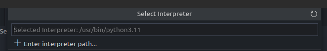
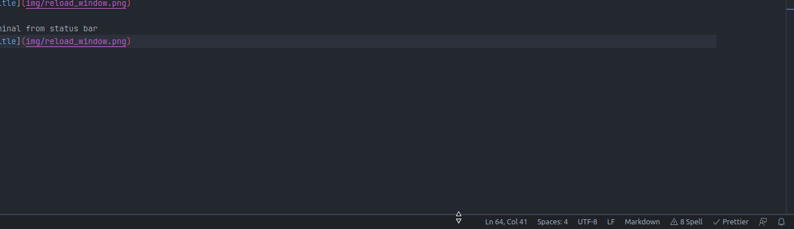
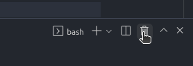
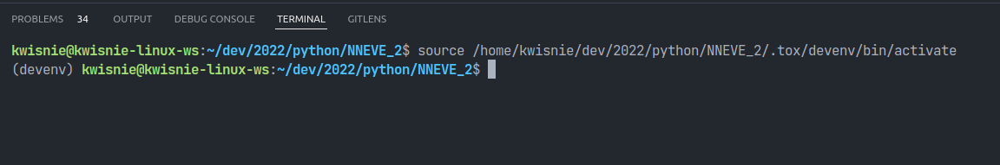

# Setup howtos

## HowTo setup tox environment

1. Acquire Python interpreter version 3.8 from [Python.org](https://www.python.org) or with package manager.

    - [Downloads section](https://www.python.org/downloads/)

    - [Last Executable Windows Release](https://www.python.org/downloads/release/python-3810/)

!!! note

    Remember to add Python to PATH.

2. Install tox with pip

    ```
    python -m pip install tox
    ```

3. Create virtual environment with tox:

    ```
    python -m tox -e devenv
    ```

4. Activate environment:

    - Windows: `".tox/devenv/Script/activate"`

    - Linux: `source ".tox/devenv/bin/activate"`

    - for more see [this](https://docs.python.org/3/tutorial/venv.html)

!!! info

    If you are using Powershell you may encounter [this problem](https://stackoverflow.com/questions/4037939/powershell-says-execution-of-scripts-is-disabled-on-this-system).

## SetUp Environment in Visual Studio Code

1. Open VSCode in your repository folder

2. Use `Ctrl+Shift+P` to open command entry

3. Enter `>Python: Select Interpreter` and click `Enter`
   

4. Select option "Enter interpreter path..."
   

5. Select option "Find..."
   

6. Navigate to

    - Windows: `NNEVE/.tox/devenv/Scripts/activate`

    - Linux: `NNEVE/.tox/devenv/bin/activate`

7. Select file `python.exe`

8. Use `Ctrl+Shift+P` to open command entry

9. Enter `>Developer: Reload Window` and click `Enter`

    

10. Open terminal by pulling from edge of status bar

    

11. Use trash can icon to kill it

    

12. Repeat step 11.

13. Now you should have `(devenv)` prefix before your command prompt

    

14. If you don't have this prefix, follow _HowTo setup tox environment_
