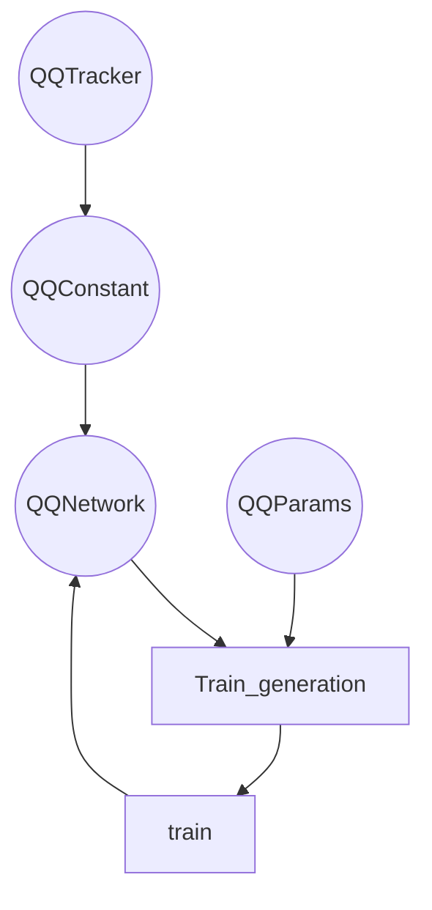

The construction of the network involves the definition of layers in the
assemble_hook method. In neural networks there is one input layer (input), one
output layer (output) and many hidden layers (d1, d2, ...). Adding hidden
layers involves adding consecutive lines of code in the form dX =
keras.layers.Dense(number_neurons, activation function, layer_name, number
precision)(layer_previous).

When building a neural network architecture, parameters within each layer can
be manipulated, e.g.: different activation functions (sin, relu, tanh), number
of neurons in each hidden layer, and changing the precision of the data

### Graph of architecture

