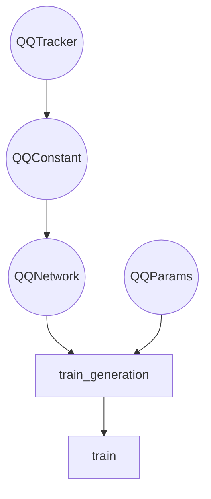

# Architecture of Neutal Network

# `#!python class QQNetwork(pydantic.BaseModel)`

## Parent classes

[`#!python class tf.keras.Model`](https://keras.io/api/models/model/)

## Introduction

QONetwork class is responsible for the learning process from the user input.

### Network structure

| name                                                                                                | type               | shape |
| --------------------------------------------------------------------------------------------------- | ------------------ | ----- |
| [`input_1 ` `(InputLayer) `](https://www.tensorflow.org/api_docs/python/tf/keras/layers/InputLayer) | `#!python float32` | `1`   |
| `eigenvalue ` `(Eigenvalue)`                                                                        | `#!python float32` | `1`   |
| [`concatenate ` `(Cocatenate)`](https://keras.io/api/layers/merging_layers/concatenate/)            | `#!python float32` | `2`   |
| [`dense_1 ` `(Dense)`](https://keras.io/api/layers/core_layers/dense/)                              | `#!python float32` | `2`   |
| [`dense_2 ` `(Dense)`](https://keras.io/api/layers/core_layers/dense/)                              | `#!python float32` | `50`  |
| [`predictions ` `(Dense)`](https://keras.io/api/layers/core_layers/dense/)                          | `#!python float32` | `1`   |

### Abstract

The construction of the network involves the definition of layers in the
assemble_hook method. In neural networks there is one input layer (input), one
output layer (output) and many hidden layers (d1, d2, ...). Adding hidden
layers involves adding consecutive lines of code in the form dX =
keras.layers.Dense(number_neurons, activation function, layer_name, number
precision)(layer_previous).

## Instance attributes

### `#!python constants:`

### `#!python is_debug: `

### `#!python loss_function: `

### `#!python is_console_mode: `

### Constructor

| name               | description                                                                                                                                                                                                           |
| ------------------ | --------------------------------------------------------------------------------------------------------------------------------------------------------------------------------------------------------------------- |
| self.constants     | QQConstants                                                                                                                                                                                                           |
| assemble_hook      | Function assemble_hook is called first, followed by the constructor of the parent class [`tf keras.model`](https://keras.io/api/models/model/)                                                                        |
| super().**init**   | This values are necessary to construct [`tf.keras.model`](https://keras.io/api/models model/), and they are used as input and output layers of neutral network for `tf.keras` to decode structure of neutral network. |
| self.loss_function | Loss function of neutral network                                                                                                                                                                                      |

### Assemble Hook

| name           | description                                                           |
| -------------- | --------------------------------------------------------------------- |
| inputs         | 1 value input layer                                                   |
| eigenvalue_out |                                                                       |
| d1             | two dense layers, each with {neurons} neurons as nautral network body |
| d2             | internal second layer                                                 |
| outputs        | single value output from neural network                               |

#### Returns

| type                   | description                                                   |
| ---------------------- | ------------------------------------------------------------- |
| `Layers (input layer)` | single output from full network, λ is accessed by single call |
| `Layers (dense)`       | to "eigenvalue" Dense layer - much cheaper op                 |

## Graph of architecture

