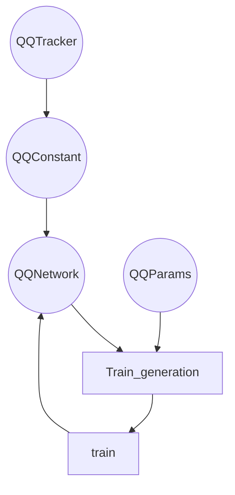

# Architecture of Neutal Network

## Parent classes

[`#!python class tf.keras.Model`](https://keras.io/api/models/model/)

## Introduction

QONetwork class is responsible for the learning process from the user input.
Our neural network architecture that simultaneously learns eigenvalues and the
associated eigenfunctions using a scanning mechanism. The proposed technique is
an extension to neural network differential equation solvers and, consequently,
acquires all the benefits that network solvers have over numerical integrators.

### Network structure

| name                                                                                                | type               | shape |
| --------------------------------------------------------------------------------------------------- | ------------------ | ----- |
| [`input_1 ` `(InputLayer) `](https://www.tensorflow.org/api_docs/python/tf/keras/layers/InputLayer) | `#!python float32` | `1`   |
| `eigenvalue ` `(Eigenvalue)`                                                                        | `#!python float32` | `1`   |
| [`concatenate ` `(Cocatenate)`](https://keras.io/api/layers/merging_layers/concatenate/)            | `#!python float32` | `2`   |
| [`dense_1 ` `(Dense)`](https://keras.io/api/layers/core_layers/dense/)                              | `#!python float32` | `2`   |
| [`dense_2 ` `(Dense)`](https://keras.io/api/layers/core_layers/dense/)                              | `#!python float32` | `50`  |
| [`predictions ` `(Dense)`](https://keras.io/api/layers/core_layers/dense/)                          | `#!python float32` | `1`   |

### Abstract

The construction of the network involves the definition of layers in the
assemble_hook method. In neural networks there is one input layer (input), one
output layer (output) and many hidden layers (d1, d2, ...). Adding hidden
layers involves adding consecutive lines of code in the form dX =
keras.layers.Dense(number_neurons, activation function, layer_name, number
precision)(layer_previous).

When building a neural network architecture, parameters within each layer can
be manipulated, e.g.: different activation functions (sin, relu, tanh), number
of neurons in each hidden layer, and changing the precision of the data.

## Instance attributes

| name            | description                             |
| --------------- | --------------------------------------- |
| constants       | constant values used in neutarl network |
| is_debug        |                                         |
| loss_function   | loss function of neutral network        |
| is_console_mode |                                         |

## Constructor

Function assemble_hook is called first, followed by the constructor of the
parent class [`tf.keras.model`](https://keras.io/api/models/model/). The
get_loss_function is also called in the constructor. Worth to mention
`super().__init__(inputs=inputs, outputs=outputs)` <-- This values are
necessary to construct [`tf.keras.model`](https://keras.io/api/models/model/),
and they are used as input and output layers of neutral network for `tf.keras`
to decode structure of neutral network.

## Assemble Hook

### Returns

| type                   | description |
| ---------------------- | ----------- | --- |
| `Layers (input layer)` |             |
| `Layers (dense)`       |             |     |

## Graph of architecture



```

```
